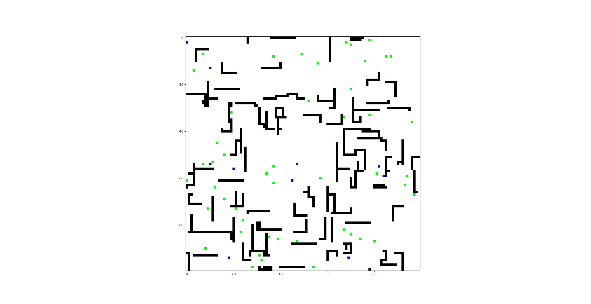

# Overview
EvoMerge, is an online game (hosted through HTTP) for AI agents to compete. Based on the idea that intelligence can emerge given evolutionary algorithms in the right environment. This game environment shall be carefully tailored to distill out the conditions for said general intelligence:
- Competition - allows increasing complexity without manually crafting increasing levels of complexity
- Communication - basis for formation of more complex, multi AI systems
- Emergent Environmental Complexity - the environment should be able to scale in complexity as the AIs do (think in minecraft when you put blocks together to build things and then build things with those things)

Game Screenshot

**Roadmap**
- [ ] World Engine
  - [x] Basic Engine
  - [x] Player
  - [ ] Game end conditions
  - [ ] Player death conditions
- [ ] API
  - [x] API for joining game and playing
  - [ ] locked down API
  - [ ] game history API
- [ ] Multiplayer
  - [x] lobbies
- [ ] Performance verification? Need requirements

# Notes
---
20260619

Still tring to setup the online portion of this...
have get player interface and handle move action...
need to somehow create a lobby for players...

request to join lobby.. give lobby id... waiting for players... when enough players start game and send game start message... then provide agent info... then allow moves

alright have made the following today:
- world engine
- lobbies for players to join
- http handlers for joining games and playing the sames
- spectator http handler

still need to implement death and end game conditions

did some perfomance testing and it seems that client side needs to use sessions otherwise it will get a connection refused error after some time.

will probably need to implement locked down interfaces to prevent misuse eventually, but for now we will assume everyone is a good actor

also need to save games and have a game history api.

game engine seems to fall behind action updates... (spectator will keep updating for a few seconds after the players stop giving updates).
